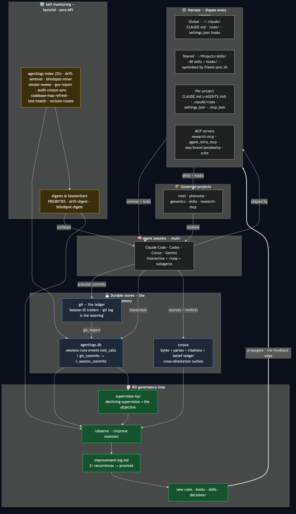

# Architecture — how the whole setup ties together

**Start here** if you want the shape of the system in one screen. This is the visual
front-door; the prose detail lives in the pointers at the bottom.



**Sources (hybrid — shape hand, inventory derived):**

| Artifact | Role |
|---|---|
| [`architecture.template.mmd`](architecture.template.mmd) | Stable topology — two loops, blocks, proposed edges |
| [`architecture.mmd`](architecture.mmd) | **Generated** — template + live launchd/orchestrator inventory |
| [`config/system-kinds.json`](config/system-kinds.json) | Closed vocabulary for `@system` tags (`layer`, `role`, `llm`) |
| Plist `<!-- @system layer=… role=… llm=… -->` | Per-job typed manifest in `ops/launchd/` |
| [`.claude/rules/orchestrator-tool-names.md`](.claude/rules/orchestrator-tool-names.md) | Session just-recipes + `layer`/`role` |

Regenerate: `just render-architecture` then `mmdc` (below). `just orient --drift` fails if
`architecture.mmd` is stale vs template+inventory. `architecture.png` is **gitignored** (derived).

## The two loops (sessions are the only sensor; the harness the only actuator)
Everything the operator does happens **inside a session** — so sessions are the system's one
ground-truth signal, and the **harness is the one thing worth changing**. The system is a
**cascaded control loop** with two timescales (verified against control theory / active inference /
H-JEPA, `research/2026-06-16-predictive-arch-rsi-loops.md`):

- **⚡ SHORT-TERM "reflex" loop** (seconds, *within one session*): SessionStart digests +
  PreToolUse guards + Stop nudges shape the live session; the human corrects in the moment; the
  agent adapts before the turn ends. No durable write needed. (`HARNESS ⇄ S1`.)
- **🔄 LONG-TERM "learning" loop** (days–weeks, *across sessions*): transcripts/commits/verdicts →
  durable stores → launchd miners (the de-facto **middle timescale**) → `/observe`+`/improve` →
  improvement-log → **2+ recurrence gate** → promote to rules/hooks/skills → propagate to the
  harness → shapes future sessions. Objective: declining supervision (`supervision-kpi`/AIR).
  - **Embed-once query layer** (added 2026-06-17, validated): the `durable stores → miners` edge no
    longer requires a per-angle LLM re-read. Sessions are embedded ONCE into a local index
    (`scripts/export_sessions_for_emb.py` → `emb embed`, $0); any NEW mining angle — recurring
    mistakes, decisions, steering signal — is then a free `emb search` / cheap `emb read`
    (retrieve-then-LLM-on-hits). Decouples the *expensive read* from the *cheap query*, so new
    miners are queries, not metered corpus passes. `research/2026-06-17-embed-once-validated-recurring-mistakes.md`.

They are **coupled**: the long loop's *output is short-loop machinery* — a hook is a reflex the
slow loop installed. Cascade-control law (Skogestad/Shinskey): the inner loop must run ~4–10×
faster than the outer or they fight; ours does (seconds vs days), so the split is sound.

## Proposed edges — verified 2026-06-16, NOT yet built
The literatures say our 2-loop cut is *correct but under-instrumented* — add **named edges, not
new loops** (full decision table + provenance in the research memo). Drawn dashed/purple in the
diagram:

| # | Edge | What it adds | Value | Status |
|---|------|--------------|-------|--------|
| ① | **Anti-windup gate** | long loop stops promoting a rule-class whose reflexes fire-but-don't-fix (AIR not dropping) — the integral-windup analog | HIGH | unblocked by the 2026-06-16 AIR-instrument fix (`supervision-kpi`) |
| ② | **Precision-weighting** | weight each miner by demonstrated precision (1−FP), not all-equal — "which detector to trust" | HIGH | clash-detector's 2-wk window already collects the number |
| ③ | **Problem-hiding guard** | alarm when supervision↓ co-occurs with error-visibility↓ (the dominant iterative-loop collapse mode; already half-stated in the constitution) | HIGH | drift-sentinel can run the joint check |
| ④ | **Anticipatory edge** (cheap only) | long loop predicts next-likely miss-class, pre-installs a reflex — the one genuinely-reactive gap. NOT an EFE planner (intractable) | MED | must pair with ① or predicting-misses-that-never-come IS the windup failure |

**All four are harness-state edges, not rules.** Each externalizes *recoverable bookkeeping* into
the harness (recurrence-per-class, per-detector precision, the joint supervision×visibility trend)
so the policy only *judges* — building any of them as a prompt instruction is the wrong layer
(constitution P1 / `decisions/2026-06-07-state-externalization-lens.md`; control theory gives the
*why*, the lens gives the *where*). Independent corroboration that the middle timescale already
exists: SAMULE micro/meso/macro reflection (EMNLP 2025). MAST (NeurIPS 2025) grounds the verdict —
44% of multi-agent failures are system-design not capability, 23.5% are task-verification (exactly
what edges ① + ③ target); its "reasoning-action mismatch" + "information withholding" categories
are candidate precision-weighted detectors we don't yet have.

DON'T import: the FEP/EFE formalism, JEPA architecture, or a Gödel-machine self-rewrite loop —
our regime is observable **scaffolding-RSI**, the converging non-FOOM kind.

## Legend (one line each → where the detail lives)
| Block | What it is | Deeper doc |
|---|---|---|
| Harness | The layered instruction/skill/hook/MCP surface loaded per session | `CLAUDE.md` §Cross-Project Architecture · `.claude/rules/context-budget-principles.md` |
| Harness verification | Eve-inspired steals: `just harness-eval` (CI gate), `approval-tiers.json` (needsApproval analog), `just session-trace` (replay) | `research/2026-06-17-vercel-eve-harness-steals.md` |
| Durable stores | git + `agentlogs.db` + corpus — the system's memory | `.claude/rules/session-forensics.md` · `decisions/2026-05-26-cross-attestation-substrate-v2.md` |
| Session extraction (embed-once) | angle-agnostic semantic index over the session corpus — any new analysis angle is a free `emb` query, not a metered re-read; mistakes/decisions/steering all become queries | `research/2026-06-17-embed-once-validated-recurring-mistakes.md` · `scripts/export_sessions_for_emb.py` |
| Lifecycle graph | `just graph <id>` — rederivable neighborhood over the RSI-lifecycle artifacts (decisions·research·predictions·commits) joined through ONE canonical relation vocab (invert-safe folds, `relates_to` non-traversable); materialized in agentlogs.db, no new store. Densified by commit→decision `implements`-edges parsed from commit bodies. | `scripts/lifecycle_relations.json` (vocab, single source) · `src/agentlogs/lifecycle.py` · `decisions-pending/2026-06-18-phaseB-implements-trailer.md` |
| Self-monitoring | zero-API launchd jobs (sense half of RSI) — **derived:** `just orient` · `just system-inventory` | `config/system-kinds.json` · `ops/launchd/*.plist` (`@system` tags) |
| Session orchestrator | file-bus pipeline — `/orchestrate`, typed just recipes | `.claude/rules/orchestrator-tool-names.md` |
| RSI governance | observe → improvement-log → promote to architecture | `CLAUDE.md` <constitution> · `.claude/rules/gov-id.md` |
| Governed projects | intel/phenome/genomics/skills + their stances | `research/cross-project-architecture-overview.md` (prose, 2026-05-11) |
| Codebase | py files by group + import-hubs (count is GENERATED, never hand-kept) | `.claude/rules/codebase-map.md` |

## Derive live state — never trust a hand-kept count

The blocks above show the **shape**; the exhaustive, current inventory is **derived**. A
hand-maintained list drifts the day you add a job (this doc said "13 jobs / 138 files" one
day after it was written). So: **what's POSSIBLE is a map (slow-changing); what's WIRED is
derived (changes hourly) — never hand-document liveness.**

### → Start with `just orient`
`just orient` (`scripts/orient.py`) IS the unifier: the live map — repos, launchd loops,
hook wiring (by event), MCP servers, skills — assembled from ground truth on every run, so
nothing in it can go stale. It correctly shows jobs added minutes ago (it reads `launchctl`,
not prose). `orient = what is it?` · `doctor = healthy?` · `dashboard = what happened?`

Drill deeper into one question:

| Question | Command |
|---|---|
| Harness change pre-commit gate (Eve `eve eval` analog) | `just harness-eval` |
| Approval-tier registry (block/warn/predicate hooks) | `uv run python3 scripts/approval_tiers.py` · `config/approval-tiers.json` |
| Session structural replay (Eve Agent Runs analog) | `just session-trace <session-uuid-prefix>` |
| Doc-vs-reality drift (manifests + architecture.mmd) | `just orient --drift` · `just system-inventory --drift` |
| Dead scripts (generator, no consumer) | `uv run python3 scripts/orphan_check.py` |
| Scaffold lifecycle (rules/hooks, shrink-eligible vs backlog) | `just gov-report` |
| Cross-project health (hooks · MCP · skills · symlinks) | `uv run python3 scripts/doctor.py` |
| Which hooks actually FIRE (not just registered) | `uv run python3 scripts/hooks_smoke.py` |
| Open human-gated decisions (pending · steward · DUE predictions) | `just questions` |
| RSI-lifecycle lineage of a decision/commit (decision↔commit↔finding neighborhood) | `just graph <id>` |

## Regenerate the image
```bash
just render-architecture
mmdc -i architecture.mmd -o architecture.png -t dark -b '#0b0f19' --scale 2 \
  -p /tmp/puppeteer-cfg.json   # cfg: {"executablePath":"<system Chrome>","args":["--no-sandbox"]}
```
