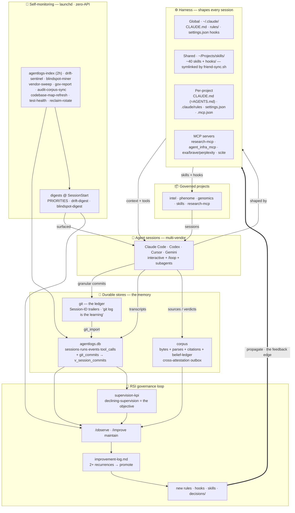

# Architecture — how the whole setup ties together

**Start here** if you want the shape of the system in one screen. This is the visual
front-door; the prose detail lives in the pointers at the bottom. Revise the diagram
when you observe drift — don't let it rot (regen: `just refresh-arch` — see below).


<details><summary>Mermaid source (edit this, then re-render)</summary>


</details>

## The loop in one sentence
Multi-vendor **sessions** are shaped by a layered **harness** → their work lands in three
**durable stores** (git ledger, `agentlogs.db`, corpus) → **launchd self-monitors** mine those
stores into SessionStart **digests** → the **RSI governance loop** (`/observe`, `/improve`)
promotes recurring findings into rules/hooks/skills → which **propagate back into the harness**
(the heavy `==>` edge). Declining supervision is the objective; the blindspot/drift miners are
how the system notices its own misses.

## Legend (one line each → where the detail lives)
| Block | What it is | Deeper doc |
|---|---|---|
| Harness | The layered instruction/skill/hook/MCP surface loaded per session | `CLAUDE.md` §Cross-Project Architecture · `.claude/rules/context-budget-principles.md` |
| Durable stores | git + `agentlogs.db` + corpus — the system's memory | `.claude/rules/session-forensics.md` · `decisions/2026-05-26-cross-attestation-substrate-v2.md` |
| Self-monitoring | 13 zero-API launchd jobs (sense half of RSI) | `CLAUDE.md` §Active launchd jobs |
| RSI governance | observe → improvement-log → promote to architecture | `CLAUDE.md` <constitution> · `.claude/rules/gov-id.md` |
| Governed projects | intel/phenome/genomics/skills + their stances | `research/cross-project-architecture-overview.md` (prose, 2026-05-11) |
| Codebase | 138 py files, groups + import-hubs | `.claude/rules/codebase-map.md` |

## Regenerate the image
```bash
mmdc -i architecture.mmd -o architecture.png -t dark -b '#0b0f19' --scale 2 \
  -p /tmp/puppeteer-cfg.json   # cfg: {"executablePath":"<system Chrome>","args":["--no-sandbox"]}
```
